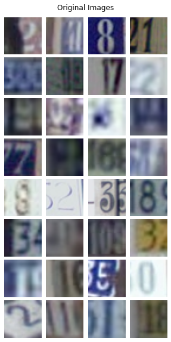
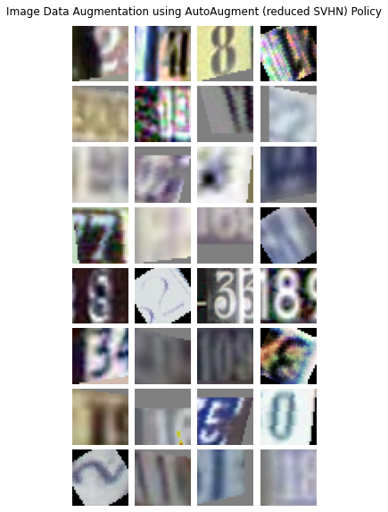
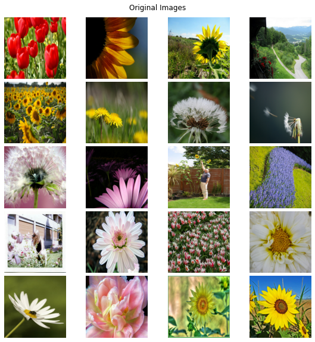
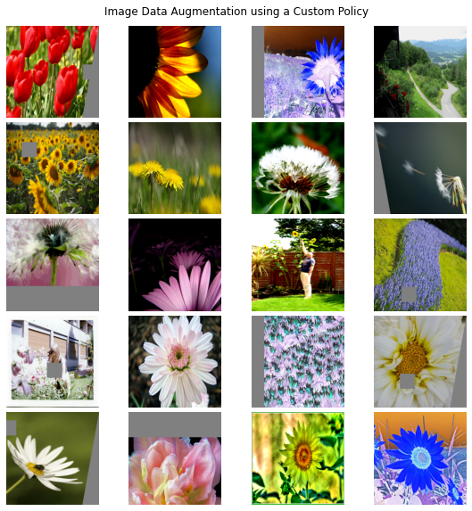
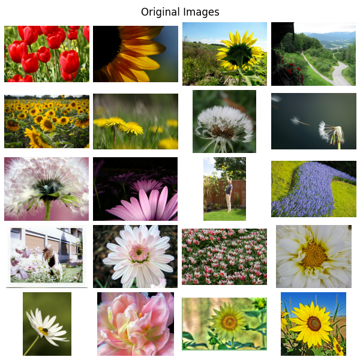
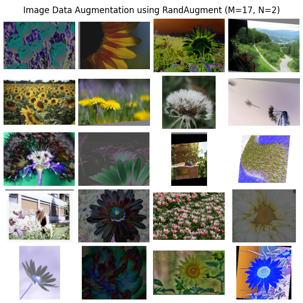

# Image Op(s)

The following is the list of image processing operations and their current implementation status.

| Image Op Name | Op Description | Status | Test Description | Test Status |
| --- | --- | --- | --- | --- |
| **AutoContrast** | Maximize the the image contrast, by making the darkest pixel black and lightest pixel white. | ✅ Implemented | Compare results of applying the operation on a random image with `PIL.ImageOps.autocontrast`.| Passing |
| **Invert** | Invert the pixels of an image. | ✅ Implemented | Compare results of applying the operation on a random image with `PIL.ImageOps.invert`. | Passing |
| **Equalize** | Equalize the image histogram. | ✅ Implemented | Compare results of applying the operation on a random image with `PIL.ImageOps.equalize`. | Passing |
| **Solarize** | Invert all pixels above a threshold value of `magnitude`. | ✅ Implemented | Compare results of applying the operation on a random image with `PIL.ImageOps.solarize`. | Passing |
| **SolarizeAdd** | Add certain intensity `magnitude` to each pixel and invert all pixels above a threshold value. | ✅ Implemented | Compare results of applying the operation with no additive value on a random image with `PIL.ImageOps.solarize`. | Passing |
| **Posterize** | Reduce the number of bits for each pixel to `magnitude` bits. | ✅ Implemented | Compare results of applying the operation on a random image with `PIL.ImageOps.posterize`. | Passing |
| **Contrast** | Adjust the `magnitude` of contrast of the image. A `magnitude=0` is for gray image whereas `magnitude=1` gives original image. | ✅ Implemented |  Compare results of applying the operation on a random image with `PIL.ImageEnhance.Contrast.enhance`.  | Passing |
| **Color** | Adjust the `magnitude` of color balance of the image. A `magnitude=0` is for grayscale image whereas `magnitude=1` gives original image. | ✅ Implemented | Compare results of applying the operation on a random image with `PIL.ImageEnhance.Color.enhance`. | Passing |
| **Brightness** | Adjust the `magnitude` of brightness of the image. A `magnitude=0` is for complete black image whereas `magnitude=1` gives original image. | ✅ Implemented | Compare results of applying the operation on a random image with `PIL.ImageEnhance.Brightness.enhance`. | Passing |
| **Sharpness** | Adjust the `magnitude` of sharpness of the image. A `magnitude=0` is for blurred image whereas `magnitude=1` gives original image. | ✅ Implemented | Compare results of applying the operation on a random image with `PIL.ImageEnhance.Sharpness.enhance`. | Passing |
| **Cutout** | Set a random square patch of side-length `magnitude` pixels to gray. (https://arxiv.org/abs/1708.04552) | ✅ Implemented | Check the results of the applying the operation, whether a few pixels have gray color values or not. <br/> TODO: Include a test with more rigour. | Passing |
| **SamplePairing** | Linearly add the image with another image with weight `magnitude`. (https://arxiv.org/abs/1801.02929) | ✅ Implemented | Display two random images paired together. <br/> TODO: Write a test that is good enough to evaluate this. | Passing |

As of now, we're reusing the following image op(s) from the TensorFlow Addons package.
These op(s) internally make use of `tfa.image.transform` which is implemented using `tf.raw_ops.ImageProjectiveTransformV2`.

| Image Op Name | Op Description | Equivalent Function |
| --- | --- | --- |
| **Shear** | Shear the image along the horizontal / vertical axis with rate `magnitude`. | `tfa.image.shear_x`, `tfa.image.shear_y` |
| **Translate** | Translate the image in the horizontal / vertical axis with rate `magnitude`. | `tfa.image.translate_xy` |
| **Rotate** | Rotate the image by `magnitude` degrees. | `tfa.image.rotate` |

# Image Data Augmentation

AutoAugment uses an augmentation policy consisting of multiple sub-policies.
Each subpolicy has two image operations associated with a `probability` and `magnitude` of effect (some image operations like `AutoContrast`, `Invert`, `Equalize` do not have any effect of `magnitude` parameter).
For any particular image of the training set, we apply a subpolicy chosen randomly from the AutoAugment policy.
The corresponding image op(s) from the selected subpolicy are then applied on the image basis their individual probabilities.

The AutoAugment paper provides details for policies found on 3 datasets:
1. Reduced ImageNet [[policy](augmentation.py#L122-L148)]
2. Reduced SVHN [[policy](augmentation.py#L95-L121)]
3. Reduced CIFAR-10 [[policy](augmentation.py#L68-L94)]

## Usage

**Example 1**: Augmenting a list of images read from disk

```python
import tensorflow as tf
from image_augmentation.image import PolicyAugmentation, autoaugment_policy

# gather list of image paths
paths = tf.convert_to_tensor([
    '/path/to/datasets/flower_photos/dandelion/4278757393_bca8415ed4_n.jpg',
    '/path/to/datasets/flower_photos/dandelion/4571681134_b605a61547_n.jpg',
    '/path/to/datasets/flower_photos/roses/6069602140_866eecf7c2_m.jpg',
    '/path/to/datasets/flower_photos/dandelion/15219268336_f2460fca88_m.jpg',
    '/path/to/datasets/flower_photos/daisy/14354051035_1037b30421_n.jpg',
    '/path/to/datasets/flower_photos/roses/3705716290_cb7d803130_n.jpg',
    '/path/to/datasets/flower_photos/sunflowers/175638423_058c07afb9.jpg',
    '/path/to/datasets/flower_photos/dandelion/4944731313_023a0508fd_n.jpg',
    '/path/to/datasets/flower_photos/roses/8642943283_47e44d049d_m.jpg',
    '/path/to/datasets/flower_photos/daisy/18442919723_d1251d3e14_n.jpg',
    '/path/to/datasets/flower_photos/roses/15011625580_7974c44bce.jpg',
    '/path/to/datasets/flower_photos/roses/16051111039_0f0626a241_n.jpg',
    '/path/to/datasets/flower_photos/sunflowers/15118397087_bfb7ea70d5_n.jpg',
    '/path/to/datasets/flower_photos/roses/1667199972_7ba7d999c1_m.jpg',
    '/path/to/datasets/flower_photos/tulips/7266196114_c2a736a15a_m.jpg',
    '/path/to/datasets/flower_photos/roses/23891005905_17ce9e6936.jpg',
    '/path/to/datasets/flower_photos/sunflowers/5979669004_d9736206c9_n.jpg',
    '/path/to/datasets/flower_photos/roses/16552686350_db8db55cd2.jpg',
    '/path/to/datasets/flower_photos/roses/269037241_07fceff56a_m.jpg',
    '/path/to/datasets/flower_photos/tulips/112951022_4892b1348b_n.jpg'
])
image_size = 331

# read a single image
@tf.function
def read_image(path):
    image = tf.io.read_file(path)
    image = tf.image.decode_jpeg(image)
    image = tf.image.resize_with_crop_or_pad(image, image_size, image_size)
    return image 
images = tf.map_fn(read_image, paths, dtype=tf.uint8)

show_images(images) # show original images

# AutoAugment all the images
imagenet_policy = autoaugment_policy()
augmenter = PolicyAugmentation(imagenet_policy)
augmented_images = augmenter(images)

show_images(augmented_images) # show augmented images
```


**Example 2**: Applying AutoAugment on a TFDS pipeline

```python
import tensorflow as tf
import tensorflow_datasets as tfds
from image_augmentation.image import PolicyAugmentation, autoaugment_policy

# load CIFAR-10 as TFDS pipeline
ds = tfds.load('cifar10', split='train', as_supervised=True)

# use AutoAugment policy for CIFAR-10
cifar10_policy = autoaugment_policy("reduced_cifar10")
augmenter = PolicyAugmentation(cifar10_policy, translate_max=16, cutout_max_size=16)

subset_size = 20
ds = ds.take(subset_size)

original_images = [image for image, label in ds]
show_images(original_images)  # show original images

def map_fn(image, label):
    augmented_image = augmenter.apply_on_image(image)
    return augmented_image, label

aug_ds = ds.map(map_fn, tf.data.experimental.AUTOTUNE)

augmented_images = [image for image, label in aug_ds]
show_images(augmented_images)  # show augmented images
```


**Example 3**: Applying AutoAugment on a batch of images

```python
import tensorflow_datasets as tfds
from image_augmentation.image import PolicyAugmentation, autoaugment_policy

# load SVHN as TFDS pipeline
ds = tfds.load('svhn_cropped', split='train', as_supervised=True)

# use AutoAugment policy for SVHN
svhn_policy = autoaugment_policy("reduced_svhn")
# PolicyAugmentation class uses a few hyperparameters for translate_max,
# rotation_max_degree, cutout_size based on input image size
# set hyper params translate_max=16, cutout_max_size=16 for 32 x 32 images
augmenter = PolicyAugmentation(svhn_policy, translate_max=16, cutout_max_size=16) 

# shuffle and apply batching on the pipeline
batch_size = 32
ds = ds.shuffle(1000).batch(batch_size)

for images, labels in ds.take(1):
    pass
show_images(images) # show original images

# apply AutoAugment
augmented_images = augmenter(images)
show_images(augmented_images) # show augmented images
```




**Example 4**: Using `PolicyAugmentation` with a custom data augmentation policy

```python
import tensorflow as tf
import tensorflow_datasets as tfds
from image_augmentation.image import PolicyAugmentation

flowers_ds = tfds.load("tf_flowers", split='train', try_gcs=True)

# use a custom augmentation policy,
# an augmentation policy is a nested list of multiple tuples
# each entry in the policy is a subpolicy which contains the 
# image op(s) and their levels
# - a subpolicy is of format ("OpName", probability, level)
# - probability decides the likeliness of applying the op
# - each level must be in range [0, 10)
custom_policy = [
    [("ShearX", 0.7, 6), ("Cutout", 0.5, 9)],
    [("TranslateX", 0.3, 3), ("Sharpness", 0.8, 9), ("Invert", 0.6, 1)],
    [("Posterize", 0.8, 1), ("Equalize", 0.3, 2), ("TranslateY", 0.3, 6)],
    [("Color", 0.4, 8), ("Contrast", 0.7, 9)]
]
augmenter = PolicyAugmentation(custom_policy)

# fetch a few images and resize them to 331 x 331
images = [tf.image.resize(sample['image'], (331, 331))
          for sample in flowers_ds.take(20)]
images = tf.cast(images, tf.uint8) # TODO: fix PolicyAugmentation operability with tf.float32 images
show_images(images) # show original images

# PolicyAugmentation class uses a few hyperparameters for translate_max,
# rotation_max_degree, cutout_size based on input image size
# which can be ignored here, default hyperparameters are basis input 331 x 331
augmented_images = augmenter(images)
show_images(augmented_images) # show augmented images
```




**Example 5**: Apply RandAugment on a TFDS image pipeline
```python
import tensorflow as tf
import tensorflow_datasets as tfds
from image_augmentation.image import RandAugment

# load TF-Flowers as TFDS pipeline
ds = tfds.load('tf_flowers', split='train', as_supervised=True)

# use AutoAugment policy for CIFAR-10
augmenter = RandAugment(17, 2)

subset_size = 20
ds = ds.take(subset_size)

original_images = [image for image, label in ds]
# show_images(original_images)  # show original images

def map_fn(image, label):
    augmented_image = augmenter.apply_on_image(image)
    return augmented_image, label

aug_ds = ds.map(map_fn, tf.data.experimental.AUTOTUNE)

augmented_images = [image for image, label in aug_ds]
show_images(augmented_images)  # show augmented images
```



